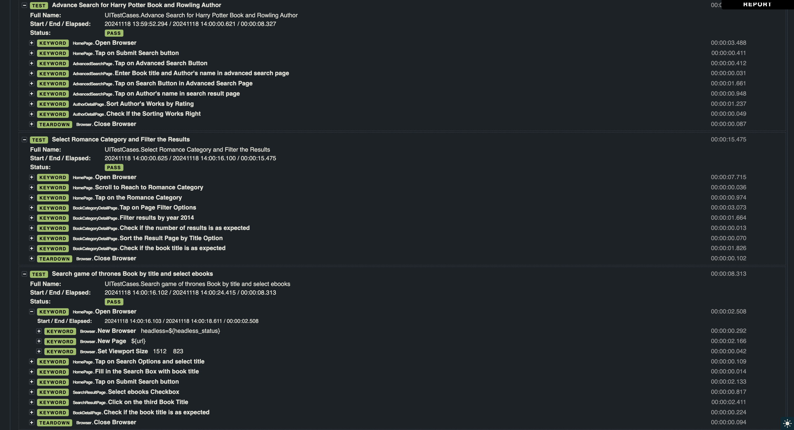

## UI Test Automation with Robot Framework & Playwright

Before running the tests, ensure that you have the following installed:

- Python (version 3.x)
- pip (Python package manager)
- Robot Framework
- Playwright libraries for browser automation (Which is Browser Library in Robot Framework)

You can install the required libraries by running the following commands:


**Installation Guide**

Follow these steps to set up the project on your machine:

## 1. Clone the Repository:

    git clone https://github.com/Mobinakadaei/UITestCases.git
    cd UITestCases

## 2. Install Dependencies:
    pip install robotframework
    pip install robotframework-browser

## 3. Running the Tests (For UI Testing):

   ```sh
   robot UITestCases.robot
   ```

## Test Approach

The UI test cases for this project are located in the TestCases/UITestCases.robot folder and will be executed following the installation steps provided earlier. I used the Page Object Model (POM) design pattern alongside Playwright for interacting with web elements in Robot Framework. This approach structures and organizes UI tests by separating the logic for interacting with web elements from the test cases themselves, making the code more maintainable, reusable, and scalable.

Keywords for interacting with each web page's elements are organized within separate files in the pageObjectModel directory. This modular structure ensures that main keywords and variables are defined and detailed within dedicated files, while the test case files focus solely on test case definitions, without embedding logic or variables. Additionally, if any variables need to be changed, they can be modified in a single, dedicated file for each page object, simplifying updates and maintenance. This separation leads to cleaner, easier-to-read, and more manageable test scripts.

Here's an overview of how I implemented this approach:

## 1. Page Object Model (POM) Structure

   Each web page in the application under test is represented by a set of keywords in a dedicated Robot Framework test file. This file encapsulates all the actions, variables, and web elements relevant to that particular page, making the code more modular and easier to maintain. 
Here is a brief description of the page structures:

   * Home Page:
   This Robot file contains Keywords and variables for interacting with the homepage, such as submitting search button, fill in the search box, scrolling home page, and tapping on specific category.

   * AdvancedSearch Page:
   This Robot file contains Keywords and variables for interacting with the Advanced Search page, after tapping on search button in the home page and selecting advanced search from the menu bar. The keywords contains entering book title or author name and clicking on submit button and ... .

   * AuthorDetail Page:
   This Robot file contains Keywords and variables for interacting with the Author Detail Page, such as sort author's works and check if the result is as expected.

   * BookCategoryDetail Page:
   This Robot file contains Keywords and variables for interacting with the Book Category Detail Page, such as sort author's works and check if the result is as expected.

   * BookDetail Page:
   This Robot file contains Keywords and variables for interacting with the Book Detail Page, check if the book title is as expected or not.

   * SearchResult Page:
   This Robot file contains Keywords and variables for interacting with the search result Page, check the checkbox or clicking on the book title.


By organizing the code in this manner, all web elements, interactions, and variables for each page are centralized in a single file, making maintenance simpler and reducing code duplication. This clear separation of concerns ensures that test logic (test cases) and page interaction logic (UI elements and actions) remain distinct. When UI changes occur, only the relevant page object needs to be updated, leaving the test cases unaffected. This approach allows for easier adaptation to UI changes without impacting the tests. Furthermore, it enhances the readability of the test scripts, as they focus solely on the behavior being tested, rather than the implementation details of UI interaction. Keeping all page-specific variables within the same file also improves modularity, making it easier to reuse the file with different variables for other test cases.

## 2. Modularized Variables

  To promote cleaner code and better separation of concerns, I have centralized all variables in the Keyword files rather than including them in the test case files. This approach results in cleaner, more modular test cases. If a change to a variable is needed, it only has to be made in one place, within the relevant page object file. With this structure, testing different scenarios with varying inputs becomes much easier. Additionally, if any web elements change, adapting to those changes is straightforward, as updates are confined to the page object, ensuring minimal impact on the test cases. I have utilized variables to name my test cases, allowing for dynamic naming. By simply changing the value of a variable, the corresponding test case name will automatically update accordingly.

  * Reusability: Variables can be accessed across different classes and test files without duplication.

  * Modularization: Changing a value (like a URL or timeout) in one place updates it across the entire test suite.

  * Readability: Test scripts are more readable and maintainable since the logic and data are separated.


## 3. Testing with Robot Framework, Playwright and Python:
  For this project, I chose Python and Robot Framework due to their strengths in test automation and suitability for the project's needs. Here are the reasons behind this decision:
   
   **Why Did I Used Robot Framework:**

   * Keyword-Driven Testing: 
   Robot Framework supports a keyword-driven approach, which is highly readable and allows even non-technical stakeholders to understand test cases. This makes collaboration and test maintenance easier

   * Built-in Reporting: 
   Robot Framework generates detailed, built-in reports and logs, which helps in quick debugging and test result analysis.(I have included my test report at the beginning of this file to showcase its detailed and comprehensive nature. The report is designed to be easily understood by all team members, whether they have technical or non-technical backgrounds.)

   * Modularity: 
   Robot Framework supports the creation of reusable test libraries and keywords, which improves test organization and minimizes code duplication. Its flexibility allows seamless integration with other tools and frameworks, such as Playwright for browser automation, enhancing the overall versatility of the testing process.


   For the UI testing I used Browser Library in Robot Framework. The Browser library in Robot Framework integrates Playwright, a browser automation tool, to provide a high-level, keyword-driven interface for automating web browsers.
   
   **Why Did I Used Playwright for UI testing:**

   * Fast and Reliable Automation: 
   Playwright is designed for high-speed and stable browser automation. It handles asynchronous events, network conditions, and dynamic content well, providing reliability even with complex web applications.

   * Integration with Robot Framework: 
   Playwright integrates well with Robot Framework, which allows for a keyword-driven testing approach. By combining Playwright's powerful browser automation capabilities with Robot Framework's modular, readable syntax, I can create easy-to-maintain, reusable test cases for UI testing.
  
   * Auto-Waiting for Elements: 
   Playwright includes automatic waiting for elements to be ready before performing interactions, reducing the need for explicit waits or time delays, which improves test stability and execution speed.

   * Flexible Locator Strategies: 
   Playwright supports multiple ways to locate elements on a page (e.g., CSS selectors, XPath, text, etc.).

   **Why Did I Used Python:**

   * Extensibility: 
   Python provides a wide range of testing libraries, including powerful tools for data handling, reporting, and integration with CI/CD pipelines, making it scalable for both small and large projects.
   
   * Scalability:
   Python's flexible design allows test frameworks and scripts to scale with the needs of a project. Whether it’s a small, one-off script or a comprehensive end-to-end testing framework with hundreds of test cases, Python can easily handle the complexity.

   * Ease of Use and Readability
   Python’s simple, clean, and highly readable syntax makes it easier for teams to write, understand, and maintain test scripts. 

## My Project Test Cases:

I have added two additional test cases to this project, and I have outlined the steps below for a clearer understanding.

**TestCase1: Select Romance Category and Filter the Results**
| Steps        | Expected Result |
|-------------|-----------------|
|Open Browser and Scroll Home page to reach to Romance category and tap on that.| Romance category detail page will open.|
|Tap on filter button and choose 2014 year form that.| Only the books related to 2014 year must be appeared with a specified number.| 
|Sort the page result by title.| Books must be sorted by their title in order.|


**TestCase2: Search a Book by title and select ebooks**
| Steps        | Expected Result |
|-------------|-----------------|
|Open Browser and set the search method to title.| Title method must be choosed.|
|Fill in the search box with a book title and tap on search.| Search results must be displayed correctly.| 
|Tap on ebooks checkbox.| Only ebooks must be shown.|
|Click on the third book title.| Book detail page must be opened correctly.|


